# ERP System Architecture

```mermaid
%%{init: {'theme': 'base', 'themeVariables': { 'primaryColor': '#1e3a5f', 'primaryTextColor': '#fff', 'primaryBorderColor': '#0d2137', 'lineColor': '#94a3b8', 'tertiaryColor': '#f0f4f8', 'fontSize': '13px'}}}%%

graph TB
  subgraph Auth["Authentication Layer"]
    A[Account<br/>universal auth]
  end

  subgraph Roles["User Roles & Dashboards"]
    direction TB
    R1["🛡️ Super Admin<br/>Full system control"] --> ADM["Admin Dashboard"]
    R2["🏪 Merchant<br/>Self-registered business"] --> MER["Merchant Dashboard"]
    R3["🏢 Company Admin<br/>Employer organization"] --> COM["Company Dashboard"]
    R4["👤 Employee<br/>Company staff"] --> EMP["Employee Dashboard"]
  end

  subgraph AdminModule["Admin Module  /admin/*"]
    direction TB
    ADM --> AQ["Action Queue<br/>Review & approvals"]
    ADM --> ADM_MER["Merchants<br/>CRUD + analytics"]
    ADM --> ADM_COM["Companies<br/>CRUD + billing"]
    ADM --> ADM_EMP["Employees<br/>Cross-company view"]
    ADM --> ADM_ANALYTICS["Platform Analytics<br/>KPIs + charts"]
    ADM --> ADM_SETTINGS["Settings + Branding<br/>Login page, config"]
    ADM --> ADM_LOGS["Audit Logs<br/>Full activity trail"]
    ADM --> ADM_CSV["CSV Uploads<br/>Bulk imports"]
  end

  subgraph MerchantModule["Merchant Module  /merchant/*"]
    direction TB
    MER --> OFFERS["Offers<br/>CRUD + replace + archive"]
    MER --> MER_ANALYTICS["Analytics<br/>Views, redemptions, trends"]
    MER --> BRANCHES["Branches<br/>In-store / Online"]
    MER --> REDEMPTIONS["Redemptions<br/>Employee claims"]
    MER --> ISSUES["Issues<br/>Support tickets"]
    MER --> PROFILE["Profile<br/>Business info"]
  end

  subgraph CompanyModule["Company Module  /company/*"]
    direction TB
    COM --> EMPLOYEES["Employees<br/>Invite, manage, CSV import"]
    COM --> COM_ANALYTICS["Analytics<br/>Redemptions, engagement"]
    COM --> BILLING["Billing<br/>Plan, invoices, renewals"]
    COM --> COM_SETTINGS["Settings<br/>Company preferences"]
  end

  subgraph EmployeeModule["Employee Module  /employee/*"]
    direction TB
    EMP --> OFFER_LIST["Offers<br/>Browse & search"]
    EMP --> SAVED["Saved<br/>Bookmarked offers"]
    EMP --> MY_REDEMPTIONS["My Redemptions<br/>Claim history"]
    EMP --> NOTIFICATIONS["Notifications<br/>In-app alerts"]
    EMP --> EMP_PROFILE["Profile & Settings"]
  end

  subgraph CoreEntities["Core Business Entities"]
    direction TB
    C["Company<br/>Organization"] --- CB["CompanyBilling<br/>Plan, pricing"]
    C --- CA["CompanyAdmin<br/>Admin users"]
    C --- E["Employee<br/>Staff members"]

    M["Merchant<br/>Business"] --- MB["MerchantBranch<br/>Physical / Online"]
    M --- MO["MerchantOffer<br/>Discount deal"]
    MO --- OC["OfferContent<br/>Description, images"]
    MO --- OP["OfferPricing<br/>Amount, percent"]
    MO --- ORD["OfferRedemption<br/>Type, limits"]
    MO --- OV["OfferReview<br/>Admin approval"]
    MO --- OA["OfferAnalytics<br/>Views, saves, clicks"]

    E --- RD["Redemption<br/>Claimed offer"]
    MO --- RD
    RD --- M
    C --- RD

    E --- OVW["OfferView<br/>Browsing history"]
    MO --- OVW
  end

  subgraph CrossCutting["Cross-Cutting Services"]
    direction TB
    AL["AuditLog<br/>Polymorphic activity trail"]
    NE["NotificationEvent<br/>In-app / Email / Push"]
    LS["LoginSession<br/>Refresh tokens"]
    AQ2["ActionQueueItem<br/>Admin task queue"]
    IR["IssueReport<br/>Support tickets"]
  end

  A --> R1
  A --> R2
  A --> R3
  A --> R4

  R1 -.-> CrossCutting
  R2 -.-> CrossCutting
  R3 -.-> CrossCutting
  R4 -.-> CrossCutting

  classDef role fill:#1e3a5f,color:#fff,stroke:#0d2137,stroke-width:2
  classDef module fill:#1a5276,color:#fff,stroke:#0d2137
  classDef entity fill:#117a65,color:#fff,stroke:#0e6655
  classDef cross fill:#6c3483,color:#fff,stroke:#5b2c6f
  class R1,R2,R3,R4 role
  class ADM,MER,COM,EMP module
  class C,M,MO,E,RD,AQ2,AL,NE,LS,IR entity
```



## System Overview

| Aspect | Detail |
|--------|--------|
| **Architecture** | Monolithic Next.js app with role-based route segments |
| **Auth** | Supabase Auth + custom `Account` table for universal identity |
| **Database** | PostgreSQL via Prisma ORM |
| **UI** | Tailwind CSS + shadcn/ui + Recharts (analytics) |
| **State** | React Query for server state |
| **Roles** | Admin, Merchant, Company Admin, Employee |

## Data Flow

```
Employee → Browse → OfferView (1 per offer)
         → Save    → NotificationEvent (saved_offer)
         → Redeem  → Redemption + OfferAnalytics.increment
         → View    → OfferAnalytics.viewCount += 1 (deduplicated)

Merchant → Create Offer  → OfferReview (admin approval)
         → View Analytics → GET /api/merchant/analytics/summary
         → Manage Branch  → MerchantBranch CRUD

Company Admin → Invite Employees → Account + Employee created
              → View Analytics   → GET /api/company/analytics
              → Manage Billing   → CompanyBilling updates

Super Admin  → Approve/Reject → ActionQueueItem resolution
             → Platform Analytics → GET /api/admin/analytics
             → System Settings   → PlatformSettings + LoginBranding
```

## Route Organization

```
/(dashboard)
  /admin/*        – Super Admin (full platform control)
  /merchant/*     – Merchant (self-service business)
  /company/*      – Company Admin (employer management)
  /employee/*     – Employee (offer browsing & redemption)
```
